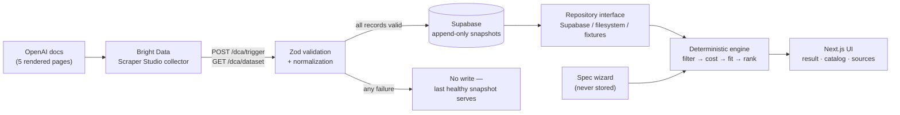

# ⚡ SpecPilot

**Find the least expensive AI model that can reliably handle your task — with the cost arithmetic, the evidence, and the reason every other model was rejected.**

[Features](#-features-deep-dive) • [Architecture](#-system-architecture) • [Getting Started](#-getting-started-local-development) • [Deploy](#-deploy-to-vercel-production)

[**Live demo**](https://spec-pilot-tau.vercel.app/) · [**GitHub**](https://github.com/thisisharsh7/spec-pilot) · [**Demo video**](https://youtu.be/O_LFug5ZBsc)

[](https://youtu.be/O_LFug5ZBsc)

---

## 🎯 The Vision

AI model pricing and capabilities are scattered across provider documentation, published in inconsistent formats, and changed without notice. Choosing a model means reading several pages, cross-referencing capability tables, and guessing — then discovering the mistake on the invoice.

SpecPilot replaces the guess with an audit trail. You describe the job in six plain questions; SpecPilot compiles that into a structured, machine-checkable specification, checks every model in its catalog against it capability by capability, and recommends the cheapest one that satisfies **every** mandatory requirement — showing the cost arithmetic, a link to the documentation page each value was read from, and the exact reason every other model was passed over.

What makes it trustworthy is what it refuses to do:

- **Cheapest compatible model wins.** Your stated priority only breaks ties.
- **No LLM picks the winner.** Cost, filtering and ranking are pure deterministic functions with unit tests. The same spec always gives the same answer.
- **Capabilities are three-state** — `true`, `false`, or **unknown**. Unverified never means unsupported: a model is never rejected on an unknown capability, and never recommended on one.
- **It refuses to guess prices.** When a page prices prompts above 272K tokens differently and your workload is 400K, SpecPilot reports *Cannot estimate* rather than quoting the cheaper tier.
- **Assumptions are labelled as assumptions.** Where a page documents no tier, the requirement reads *Assumed*, not *Met*.
- **Your task description is never stored.** No database row, never in a URL.

---

## 🎨 Interface & Workflows

Timestamps link into the [demo video](https://youtu.be/O_LFug5ZBsc).

### 1️⃣ Specification wizard — [0:12](https://youtu.be/O_LFug5ZBsc?t=12)

Six steps, no model names anywhere. You describe inputs, outputs, volume and what is non-negotiable; selecting an input type *becomes* a hard requirement. Nothing is asked twice.

### 2️⃣ Machine-checkable spec — [0:35](https://youtu.be/O_LFug5ZBsc?t=35)

Your answers compile into a structured specification with expected failure cases and acceptance tests generated by fixed rules, not by a model. Copy as Markdown or download it — it never reaches a server.

### 3️⃣ Recommendation & cost breakdown — [0:45](https://youtu.be/O_LFug5ZBsc?t=45)

The monthly estimate broken into requests, tokens and per-direction cost. No blended averages. A requirement-fit panel states how many criteria rest on an assumption, a *Cannot estimate* section explains every refusal, and a *Rejected* list gives each excluded model its exact reason.

### 4️⃣ Catalog & source health — [1:15](https://youtu.be/O_LFug5ZBsc?t=75)

`/catalog` is a searchable table of every model with its capability states and a link to the page each value came from. `/sources` reports collector health, records received versus validated, and data freshness — including when a provider has no collector at all.

---

## ✨ Features Deep Dive

| Feature | Description |
|---|---|
| 🧭 **Specification Wizard** | Six plain steps compile a described workload into a structured, machine-checkable spec — `fieldset`/`legend` per group, real labels, `aria-invalid` + `aria-describedby`, `role="alert"` errors, focus moved to the step heading on navigation. |
| 🧮 **Deterministic Engine** | Cost, filtering, fit and ranking are pure functions under unit test. Cheapest compatible model wins; priority breaks ties only. No model call decides the outcome. |
| 🕸️ **Bright Data Collector** | A custom Scraper Studio collector, generated from a natural-language prompt, reads five rendered OpenAI model-documentation pages. Every price and capability in the app links back to its source page. |
| 🛡️ **Three-State Honesty** | Supported / Unsupported / **Unknown**, each with a distinct icon *and* word — status is never carried by colour alone, and *Assumed* gets its own hollow-diamond affordance, distinct from a tick. |
| 🧊 **Durable Snapshots** | Validate everything first, insert only on complete success, append-only storage enforced by database triggers. A failed or partial collector run cannot damage the dataset; the previous healthy snapshot keeps serving traffic. |
| 🔐 **Contained Secrets** | Every module reading a secret is `import "server-only"`, so the build fails if one reaches a client bundle — and a test suite asserts that, plus no `NEXT_PUBLIC_` secret, and no secret in a client component, log line or API response. |
| 📊 **One Chart, Earning Its Place** | A single cost-comparison bar chart with an accompanying screen-reader table. No decorative dashboards. |

---

## 🏗️ System Architecture



Model data flows one way and is never edited in place. The wizard's spec is held client-side and posted to `/api/recommend`; the engine that answers it is deterministic and testable in isolation from both the UI and the data source.

**Stack:** Next.js 16 · React 19 · TypeScript · Tailwind CSS v4 · Supabase · Zod · Recharts · Vitest — **190 tests**, clean type check, lint and production build.

---

## 🕸️ Bright Data & Self-Healing

SpecPilot uses a **custom Bright Data Scraper Studio collector** (`c_mt5e3u8x1i6gngb4se`), generated from a natural-language prompt — not a Scrapers Library scraper. It reads five public rendered OpenAI model-documentation pages.

Correct API usage from current documentation: `POST /dca/trigger` with a JSON array body, then `GET /dca/dataset?id=…` **branching on HTTP status (202 vs 200)** rather than on array emptiness — which is the bug the vendor's own examples contain.

Engineering findings, tested rather than assumed: `openai.com/api/pricing/` is bot-blocked (403) to non-browser clients, the `.md` documentation variants fail AI generation entirely, and the rendered pages are what works.

**The self-healing loop, honestly reported.** A heal proposed capturing the page's Modalities table. That proposal was **rejected**: `Image / "Input only"` produced a `null` output status when the page explicitly states output is *not supported*. A corrected prompt produced the right mapping and was **approved as a draft**.

> **That healed schema was not promoted to production.** Production runs the original schema, so audio and document support remain **unknown** rather than falsely reported.

### Example structured output

Abridged, from a real collector run:

```json
{
  "model_id": "gpt-5.6-luna",
  "display_name": "GPT-5.6 Luna",
  "input_modalities": ["Text", "Image"],
  "output_modalities": ["Text"],
  "context_window_tokens": 1050000,
  "max_output_tokens": 128000,
  "standard_input_usd_per_1m": 0.2,
  "standard_cached_input_usd_per_1m": 0.02,
  "standard_output_usd_per_1m": 1.2,
  "features": [
    { "feature_name": "Function calling", "status": "Supported" },
    { "feature_name": "Structured outputs", "status": "Supported" },
    { "feature_name": "Fine-tuning", "status": "Not supported" }
  ],
  "url": "https://developers.openai.com/api/docs/models/gpt-5.6-luna"
}
```

Normalization tests run against **verbatim real collector output**, preserving its actual quirks — a missing `pricing_note` key, title-cased modalities, human-readable feature labels — so the parser is proven against reality, not against an idealised fixture.

---

## 🚀 Getting Started (Local Development)

### Prerequisites

- Node.js 20+
- A Supabase project *(optional locally — fixtures cover it)*
- A Bright Data API token and collector ID *(optional locally)*

### Installation

1. **Clone the repository**

   ```bash
   git clone https://github.com/thisisharsh7/spec-pilot
   cd spec-pilot
   ```

2. **Install dependencies**

   ```bash
   npm install
   ```

3. **Configure environment variables**

   ```bash
   cp .env.example .env.local
   ```

   | Variable | Description | Scope |
   |---|---|---|
   | `ENABLE_DEVELOPMENT_FIXTURES` | Serve typed, hand-transcribed fixtures instead of live collector output. Set to `true` to run with no external services. | local only |
   | `NEXT_PUBLIC_SUPABASE_URL` | Supabase project URL. Browser-visible by design. | public |
   | `SUPABASE_SERVICE_ROLE_KEY` | Bypasses RLS — read only by `lib/data/supabase-admin.ts`. Never prefix with `NEXT_PUBLIC_`. | **server only** |
   | `BRIGHT_DATA_API_TOKEN` | From Account Settings → API Tokens. | **server only** |
   | `BRIGHT_DATA_OPENAI_COLLECTOR_ID` | Scraper Studio collector ID; always begins with `c_`. | **server only** |
   | `ADMIN_REFRESH_SECRET` | Guards `POST /api/providers/[provider]/refresh`, compared in constant time. Without it the endpoint refuses to run. | **server only** |

   Every variable is documented inline in `.env.example`, including the deliberate absence of a Supabase anon key: every read and write is server-side, and `model_snapshots` has RLS enabled with no anonymous policy at all.

4. **Start the development server**

   ```bash
   npm run dev
   ```

5. **Verify the checks pass**

   ```bash
   npm test && npx tsc --noEmit && npm run lint && npm run build
   ```

### Optional: run against real data

Apply `supabase/migrations/0001_model_snapshots.sql` to your Supabase project, unset `ENABLE_DEVELOPMENT_FIXTURES`, then trigger a collector run:

```bash
curl -X POST http://localhost:3000/api/providers/openai/refresh \
  -H "Authorization: Bearer $ADMIN_REFRESH_SECRET"
```

A locally collected snapshot can instead be uploaded with `npm run seed:supabase -- --confirm` — a separate, explicit command, because it writes production data and must never run as a side effect of a build.

`/sources` will report OpenAI as **Healthy** with records received versus validated. When fixtures are the active source, the UI shows a **Development data** badge — and serving them under `NODE_ENV=production` requires a second, deliberate opt-in, so a fixture-backed deployment is impossible by accident.

---

## ☁️ Deploy to Vercel (Production)

1. **Create the database.** Run `supabase/migrations/0001_model_snapshots.sql` against your Supabase project. It creates `model_snapshots` with RLS enabled and append-only triggers.
2. **Import the repository** into Vercel as a Next.js project.
3. **Add environment variables** in the Vercel dashboard: `NEXT_PUBLIC_SUPABASE_URL`, `SUPABASE_SERVICE_ROLE_KEY`, `BRIGHT_DATA_API_TOKEN`, `BRIGHT_DATA_OPENAI_COLLECTOR_ID`, `ADMIN_REFRESH_SECRET`. Leave `ENABLE_DEVELOPMENT_FIXTURES` and `ALLOW_FIXTURES_IN_PRODUCTION` unset.
4. **Deploy**, then populate the catalog by calling the authenticated refresh endpoint once. Filesystem snapshots are disabled entirely under `NODE_ENV=production`, so Supabase is the only production source.

---

## 📖 Usage Guide

1. **Describe** — answer six plain questions about the job: what goes in, what comes out, how much volume, what is non-negotiable. No model names required.
2. **Review** — check the compiled specification, with its expected failure cases and acceptance tests. Copy as Markdown or download it.
3. **Recommend** — get the cheapest model that satisfies every mandatory requirement, the full cost arithmetic, and the requirement-fit breakdown.
4. **Audit** — read why each other model was rejected or could not be estimated, then follow any value in `/catalog` back to the documentation page it was read from.

---

## 📂 Project Structure

```
spec-pilot/
├── app/
│   ├── api/
│   │   ├── recommend/                  # Deterministic recommendation endpoint
│   │   └── providers/[provider]/refresh # Authenticated collector trigger
│   ├── spec/                           # Six-step wizard
│   ├── result/                         # Recommendation, cost, rejections
│   ├── catalog/                        # Searchable model table + sources
│   ├── sources/                        # Collector health & freshness
│   └── page.tsx                        # Landing
├── components/                         # Chart, nav, footer, UI primitives
├── lib/
│   ├── brightdata/                     # Client, Zod schema, normalization, targets
│   ├── data/                           # Repository interface: Supabase / fs / fixtures
│   ├── domain/                         # Spec, requirements, wizard, summary
│   └── engine/                         # filter · cost · fit · rank · recommend
├── supabase/migrations/                # model_snapshots, RLS, append-only triggers
├── docs/                               # DEMO.md, SUBMISSION.md
├── tests/secrets.test.ts               # Secret-containment assertions
└── DESIGN.md                           # Token layer, surface ladder, button scales
```

One data interface, three implementations. No page or component imports a data source directly, so swapping the backend required no UI change.

---

## ✅ Honest Status

| | |
|---|---|
| OpenAI collector | **Live** — real collector, 5 models |
| Anthropic | **Not implemented**, labelled "Coming soon" in the UI |
| `supportsAudio` / `supportsFiles` | **Unknown** — not stated on the rendered pages |
| `modality_support` heal | approved **draft only**, not in production |
| Task specifications | **never stored** |
| Benchmarks | **none run** — "requirement fit" is spec match, not accuracy |
| Pricing coverage | standard token pricing only |

---

## 📜 Hackathon Disclosure

Built for **Into the Scrape-Verse — WeMakeDevs × Bright Data**, August 17–23, 2026. Solo submission by [@thisisharsh7](https://github.com/thisisharsh7). Primary track: **Suit-Up — Best UI**.

In adherence to the hackathon rules, I fully disclose that AI coding assistants (Claude Code and Codex) were used to accelerate implementation. All core decisions were driven solely by me as a solo developer: the idea, the architecture, the service configuration, the prompt engineering for the collector, the database schema, the design system, and the review that caught and **rejected** an incorrect self-heal. I verified every output and tested the deployment.

---

Built with ❤️ for **Into the Scrape-Verse**.
