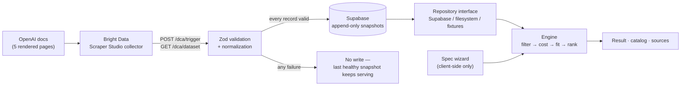

# SpecPilot

Find the least expensive AI model that can reliably handle your task — with the cost arithmetic, the evidence, and the reason every other model was rejected.

[Live demo](https://spec-pilot-tau.vercel.app/) · [Demo video](https://youtu.be/O_LFug5ZBsc)

[](https://youtu.be/O_LFug5ZBsc)

## What it does

Model pricing and capabilities are spread across provider documentation, written in inconsistent formats, and changed without notice. Picking a model means reading several pages and guessing.

SpecPilot asks six plain questions about your task — what goes in, what comes out, how much volume, what is non-negotiable — compiles the answers into a structured specification, and checks every model in its catalog against it. You get the cheapest model that satisfies every mandatory requirement, the arithmetic behind the monthly estimate, and the reason each other model was passed over. `/catalog` lists every model with a link to the page each value was read from; `/sources` reports collector health and data freshness.

## What it refuses to do

- **No model call decides the outcome.** Filtering, cost and ranking are pure functions with unit tests. Cost is always the primary sort key and your stated priority only breaks ties, so a "cheaper compatible alternative" cannot exist by construction.
- **Capabilities are three-state** — `true`, `false`, or `null` meaning *the documentation doesn't say*. A model is never rejected on an unknown capability, and never recommended on one.
- **It won't guess a price it can't see.** When a page prices prompts above 272K tokens differently and your workload is 400K, the result reads *Cannot estimate*, with the reason, instead of quoting the cheaper tier.
- **Assumptions say so.** Where a page documents no tier, the requirement reads *Assumed*, not *Met*, and the fit panel counts how many criteria rest on an assumption.
- **Task descriptions are never stored** — not in a database row, not in a URL.

## How it works



The wizard holds your spec in the browser and posts it to `/api/recommend`. The engine that answers is deterministic and testable apart from both the UI and the data source: one repository interface has three implementations (Supabase, filesystem, fixtures), and no page or component imports a data source directly.

Snapshots are append-only, enforced by database triggers, and written only after every record in a run validates. A failed or partial collector run therefore can't damage the catalog — the previous healthy snapshot keeps serving.

Secrets are contained structurally. Every module that reads one is `import "server-only"`, so the build fails if it reaches a client bundle, and `tests/secrets.test.ts` asserts that plus no `NEXT_PUBLIC_` secret and no secret in a log line or API response. There is deliberately no Supabase anon key: every read and write is server-side, and `model_snapshots` has RLS enabled with no anonymous policy.

Built with Next.js 16, React 19, TypeScript, Tailwind CSS v4, Supabase, Zod, Recharts and Vitest. 190 tests across 14 files; type check, lint and production build clean.

## Where the data comes from

A custom Bright Data Scraper Studio collector (`c_mt5e3u8x1i6gngb4se`), generated from a natural-language prompt rather than taken from the Scrapers Library, reads five public rendered OpenAI model-documentation pages.

The client posts to `/dca/trigger` with a JSON array body, then polls `GET /dca/dataset?id=…` and branches on HTTP status — 202 for still-running, 200 for ready — rather than on whether the returned array is empty, which is what the vendor's own examples do and gets it wrong.

Three things were found by testing rather than assumed: `openai.com/api/pricing/` returns 403 to non-browser clients, the `.md` documentation variants fail AI generation outright, and the rendered pages are what actually works.

The self-healing workflow was exercised, and the first proposal was **rejected**. It offered to capture the page's Modalities table, but mapped `Image / "Input only"` to a `null` output status when the page explicitly says output is not supported. A corrected prompt produced the right mapping and was approved as a draft.

That healed schema was not promoted. Production runs the original one, so audio and document support stay `null` rather than being reported wrongly.

Abridged output from a real collector run:

```json
{
  "model_id": "gpt-5.6-luna",
  "display_name": "GPT-5.6 Luna",
  "input_modalities": ["Text", "Image"],
  "output_modalities": ["Text"],
  "context_window_tokens": 1050000,
  "max_output_tokens": 128000,
  "standard_input_usd_per_1m": 0.2,
  "standard_cached_input_usd_per_1m": 0.02,
  "standard_output_usd_per_1m": 1.2,
  "features": [
    { "feature_name": "Function calling", "status": "Supported" },
    { "feature_name": "Structured outputs", "status": "Supported" },
    { "feature_name": "Fine-tuning", "status": "Not supported" }
  ],
  "url": "https://developers.openai.com/api/docs/models/gpt-5.6-luna"
}
```

The normalization tests run against output copied verbatim from a real run, quirks included — a missing `pricing_note` key, title-cased modalities, human-readable feature labels — so the parser is tested against what the collector actually returns.

## Running it locally

Requires Node.js 20+. No external services needed: the fixtures cover the catalog.

```bash
git clone https://github.com/thisisharsh7/spec-pilot
cd spec-pilot
npm install
cp .env.example .env.local   # ENABLE_DEVELOPMENT_FIXTURES=true is already set
npm run dev
```

The UI shows a **Development data** badge whenever fixtures are the active source. Serving them under `NODE_ENV=production` needs a second, separate opt-in, so a fixture-backed deployment can't happen by accident.

Checks:

```bash
npm test && npx tsc --noEmit && npm run lint && npm run build
```

For real data, apply `supabase/migrations/0001_model_snapshots.sql`, fill in the Supabase and Bright Data values documented in `.env.example`, unset `ENABLE_DEVELOPMENT_FIXTURES`, and trigger a collector run:

```bash
curl -X POST http://localhost:3000/api/providers/openai/refresh \
  -H "Authorization: Bearer $ADMIN_REFRESH_SECRET"
```

`ADMIN_REFRESH_SECRET` guards that endpoint and is compared in constant time; without it configured, the endpoint refuses to run rather than accepting unauthenticated requests.

## Project structure

```
spec-pilot/
├── app/
│   ├── api/
│   │   ├── recommend/                   # Recommendation endpoint
│   │   └── providers/[provider]/refresh # Authenticated collector trigger
│   ├── spec/                            # Six-step wizard
│   ├── result/                          # Recommendation, cost, rejections
│   ├── catalog/                         # Model table with source links
│   └── sources/                         # Collector health and freshness
├── components/                          # Cost chart, nav, footer, UI primitives
├── lib/
│   ├── brightdata/                      # Client, Zod schema, normalization, targets
│   ├── data/                            # Repository: Supabase / filesystem / fixtures
│   ├── domain/                          # Spec, requirements, wizard, summary
│   └── engine/                          # filter · cost · fit · rank · recommend
├── supabase/migrations/                 # model_snapshots, RLS, append-only triggers
├── docs/                                # DEMO.md, SUBMISSION.md
├── tests/secrets.test.ts                # Secret-containment assertions
└── DESIGN.md                            # Colors, typography, layout, components
```

## Status

| | |
|---|---|
| OpenAI collector | Live — real collector, 5 models |
| Anthropic | Not implemented, labelled "Coming soon" in the UI |
| `supportsAudio` / `supportsFiles` | `null` — not stated on the rendered pages |
| `modality_support` heal | approved draft only, not in production |
| Task specifications | never stored |
| Benchmarks | none run — "requirement fit" means spec match, not accuracy |
| Pricing coverage | standard token pricing only |

## Hackathon disclosure

Built for Into the Scrape-Verse (WeMakeDevs × Bright Data), August 17–23, 2026. Solo submission by [@thisisharsh7](https://github.com/thisisharsh7), primary track Suit-Up — Best UI.

Claude Code and Codex were used as coding assistants. I chose the idea, directed the architecture, configured the services, wrote the collector prompt, designed the database schema and the design system, reviewed the outputs, rejected the incorrect heal, and tested the deployment.
